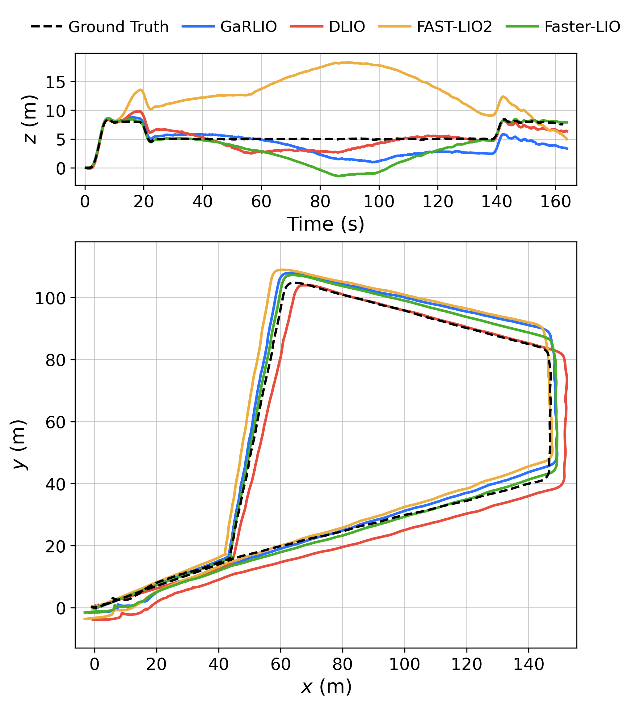
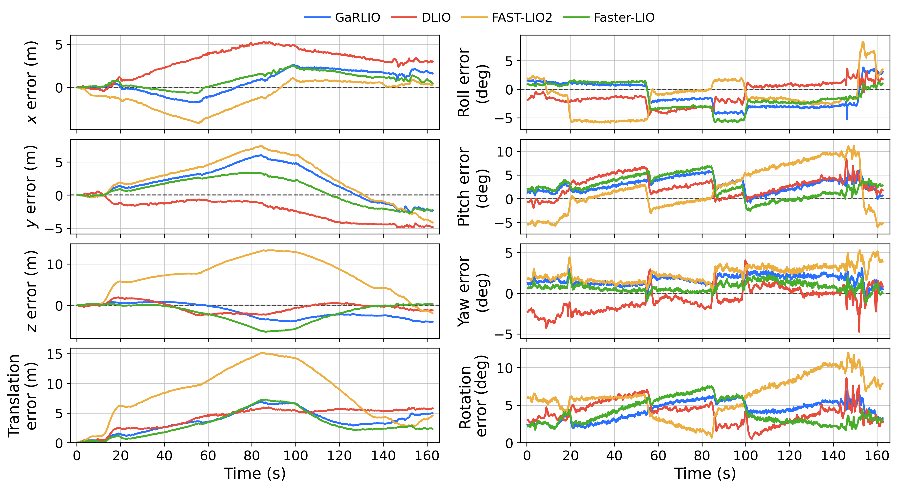

# slam_eval_tools

***Evaluation tools of odometry and SLAM based on core code of  [evo-v1.31.1](https://github.com/MichaelGrupp/evo/tree/86f52ade6da8cc4749c6170b1d2771ea1e0f1c66).***


## Usages

### Paper-style trajectory comparison



Plot TUM trajectories with height versus time on top and an equal-aspect XY trajectory comparison below. 
Both panels share algorithm colors and a legend; ground truth is drawn as a black dashed line. No zoom-in panels are added.

```bash
python3 tools/plot_traj.py garlio.tum dlio.tum fast_lio2.tum point_lio.tum \
  --ref ground_truth.tum \
  --labels GaRLIO DLIO FAST-LIO2 Point-LIO \
  --output comparison.pdf comparison.svg comparison.png
```

The script uses this repository's `evo` readers, trajectory validation and alignment functions. 
By default it plots the complete trajectories in their original coordinate frames. 
Time is relative to the first ground truth timestamp, using each trajectory's own timestamps without resampling.

- `--align origin|se3|sim3`: optionally align each estimate to ground truth.
  Alignment is fitted using timestamp-associated poses and applied to the full estimate. 
  `origin` uses the first matched pose; `sim3` also corrects scale.
- `--t-max-diff 0.01`: maximum timestamp difference for alignment, in seconds.
- `--t-offset 0.0`: offset added to all estimate timestamps before alignment and plotting, in seconds.
- `--colors '#2970ff' '#e74c3c' '#edae40' '#48ad2a'`: custom algorithm colors.
- `--figsize 10 7.5`, `--legend-cols 5`, `--title 'Sequence name'`: layout options.
- `--dpi 300`: raster export resolution. `--show` opens an interactive window.

Labels default to file stems. Output defaults to `trajectory_comparison.pdf`; existing output files are overwritten. 
The default export works without a GUI.

### XYZ and RPY component errors




```bash
python3 tools/plot_pose_errors.py garlio.tum dlio.tum fast_lio2.tum point_lio.tum \
  --ref ground_truth.tum \
  --labels GaRLIO DLIO FAST-LIO2 Point-LIO \
  --output pose_errors.pdf pose_errors.png
```

The compact 4-by-2 layout shows X/Y/Z errors in the left column and roll/pitch/yaw errors in the right column. 
The bottom row shows total translation error (m) and rotation error (degrees), computed using evo's APE metrics. 
Translation is the Euclidean position-error norm; rotation is the angle of the relative rotation, rather than a norm of the RPY differences. 
The default figure size is 12 by 6.5 inches; `--figsize` adjusts the panel heights.
The bottom panels show per-pose APE curves. Y-axis labels are aligned within each column.
Algorithms share colors and a legend; the dashed zero line represents agreement with ground truth. 
All subplots share a time axis relative to the first ground truth timestamp. 
Each estimate is associated independently with ground truth using evo's nearest-timestamp matching (`--t-max-diff`, default 0.01 seconds), without interpolation. Only matched poses contribute errors.

Position errors are signed estimate-minus-reference components in the common world frame. 
RPY errors are differences of fixed-axis XYZ Euler angles (`sxyz`), wrapped to [-180, 180) degrees. 
These are Euler-component differences, rather than Euler angles of a relative rotation; near pitch +/-90 degrees, the Euler representation is singular and component curves need careful interpretation.

The alignment, time offset, label, color and export options are the same as `plot_traj.py`. 
Alignment defaults to `none`; use `--align origin|se3|sim3` if needed. 
The default output is `pose_errors.pdf`. 
Edit the paths in `tools/plot_pose_errors.sh` and run it with `sh` for a complete example.


### APE RMSE summary

```bash
python3 tools/ape_rmse.py garlio.tum dlio.tum fast_lio2.tum point_lio.tum \
  --ref ground_truth.tum \
  --labels GaRLIO DLIO FAST-LIO2 Point-LIO \
  --output ape_rmse.csv
```

Prints each method's matched pose count, rotation APE RMSE in degrees and translation APE RMSE in meters. 
Translation uses the Euclidean position-error norm; rotation uses the angle of the relative rotation. 
Each RMSE is computed as `sqrt(mean(error**2))` over the timestamp-associated poses.
The optional `--output` saves these values to CSV with full numeric precision.
Labels default to file stems. The script uses the same `--align`, `--t-max-diff` and `--t-offset` options as the plotting scripts; alignment defaults to `none`.

For a shortcut matching the plotting scripts, edit the paths in `tools/ape_rmse.sh`, then run:

```bash
sh tools/ape_rmse.sh
```

The shell script prints all methods' RMSE values and saves `ape_rmse.csv` in its configured `output_dir`. 
Set `PYTHON` to use a different Python interpreter.

### Batch APE RMSE for multiple sequences

Edit `tools/batch_ape_rmse.sh` to configure the directories, sequences, methods, display labels and file templates, then run:

```bash
sh tools/batch_ape_rmse.sh
```

Or invoke the Python script directly:

```bash
python3 tools/batch_ape_rmse.py \
  --data-dir /path/to/data \
  --sequences NJFlatB01 NJFlatB02 \
  --methods GARLIO DLIO FASTLIO2 FASTERLIO \
  --labels GaRLIO DLIO FAST-LIO2 Faster-LIO \
  --output batch_ape_rmse.csv
```

By default, reference files are `{sequence}.txt` and estimate files are `{sequence}_{method}.txt`, relative to `--data-dir`. For nested directories or other extensions, set templates such as `--ref-pattern '{sequence}/gt.tum'` and `--est-pattern '{sequence}/{method}.tum'`. Method names select files; optional labels control the displayed names.

The script reuses `ape_rmse.py` and evaluates every sequence/method combination.
The table shows sequence, method, matched poses, rotation RMSE (degrees), then translation RMSE (meters). 
The CSV also includes the method identifier, label, status and error message, with full numeric precision. 
Failed combinations have empty numeric fields and appear as `N/A` in the table; remaining evaluations continue. 
Exit status is 1 if any evaluation failed, 0 if all succeeded.
The `--align`, `--t-max-diff` and `--t-offset` options match the single-sequence script. 
Each method is matched independently to its sequence's ground truth.

## Related Work
[evo](https://github.com/MichaelGrupp/evo/tree/86f52ade6da8cc4749c6170b1d2771ea1e0f1c66): Python package for the evaluation of odometry and SLAM.

```
@misc{grupp2017evo,
  title={evo: Python package for the evaluation of odometry and SLAM.},
  author={Grupp, Michael},
  howpublished={\url{https://github.com/MichaelGrupp/evo}},
  year={2017}
}
```